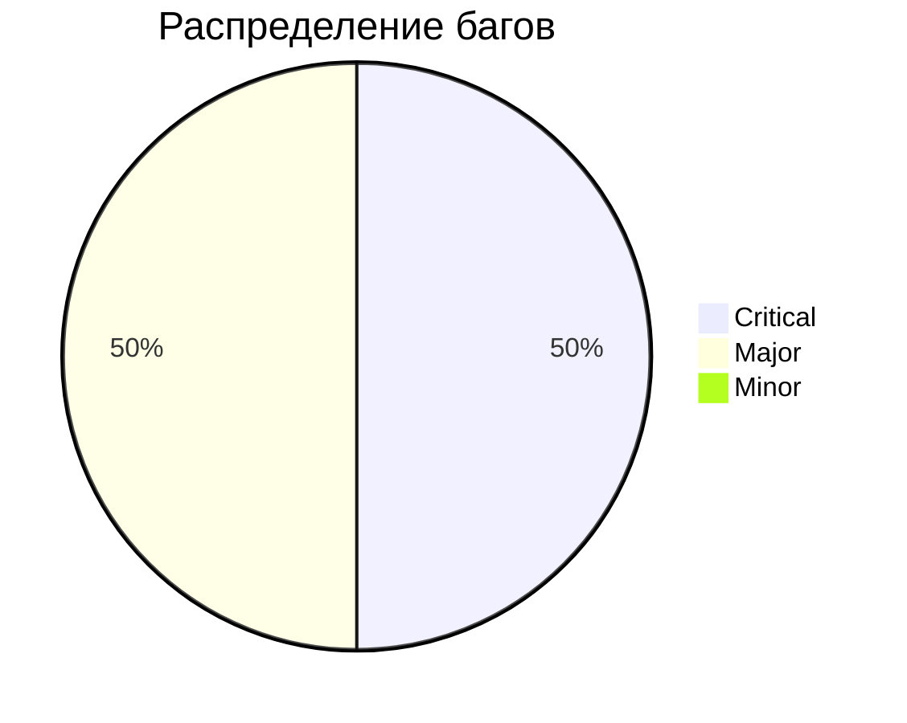

# Отчёт о тестировании формы логина DemoQA
**Дата:** 08.05.2024  
**Тестировщик:** [Ваше имя]  

## 🔍 Обзор тестирования
| Тип тестирования | Статус   |
|------------------|----------|
| Функциональное   | ✅ 80%   |
| Безопасность     | ⚠️ 60%   |
| Юзабилити        | ❌ 30%   |

## 🐞 Найденные баги
### 1. XSS-уязвимость
**Серьёзность:** Critical  
**Шаги воспроизведения:**
1. Перейти на https://demoqa.com/login
2. В поле пароля ввести: `<script>alert(1)</script>`
3. Нажать "Login"

**Ожидаемый результат:** Инпут санитизируется  
**Фактический результат:** Выполняется JS-код  
**Скриншот:**  


### 2. 500 ошибка при длинном пароле
**Серьёзность:** Major  
**Лог ошибки:**
```http
POST /login HTTP/1.1
...
{"userName":"test","password":"AAA...255 symbols...AAA"}
```
**Ответ сервера:**
```json
{"status":500,"error":"Internal Server Error"}
```

## 📊 Результаты

